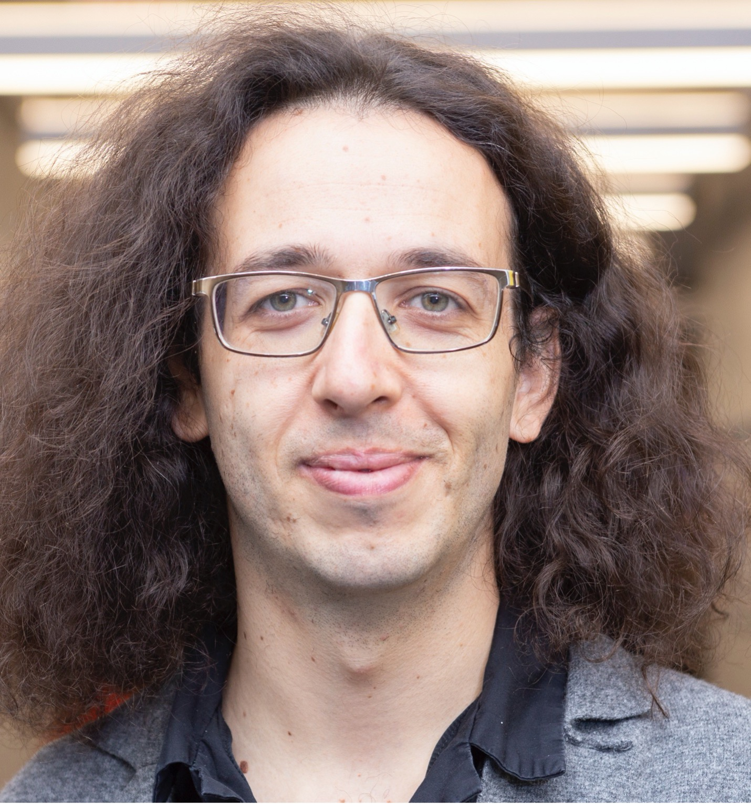

# Fall 2021
### Thursdays, 11:00am-12:20pm

 

### Sep 30th - [James Evans](https://github.com/uchicago-computation-workshop/Fall2021/tree/master/fall2021mixer)

### Oct 7th - [Ufuk Akcigit](https://github.com/uchicago-computation-workshop/Fall2021/tree/master/10-07_Akcigit)

### Oct 14th - [Sendhil Mullainathan](https://github.com/uchicago-computation-workshop/Fall2021/tree/master/10-14_Mullainathan)

### Oct 21st - [Anjali Adukia](https://github.com/uchicago-computation-workshop/Fall2021/tree/master/10-21_Adukia)

### Oct 28th - [Abdullah Almaatouq](https://github.com/uchicago-computation-workshop/Fall2021/tree/master/10-28_Almaatouq)

### Nov 11th - [Pedro Lopes](https://github.com/uchicago-computation-workshop/Fall2021/tree/master/11-11_Lopes)

